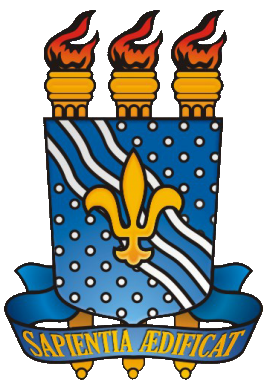
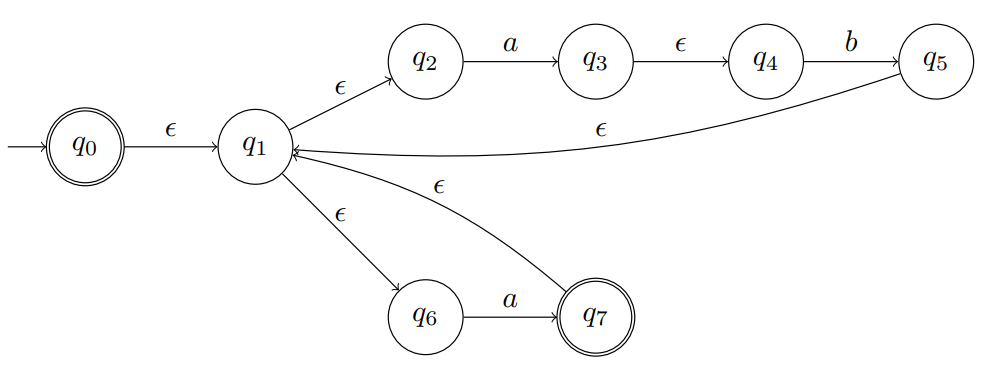

# Nondeterministic finite automaton simulator

  
  

NFA (nondeterministic finite automaton) simulator using C++. This project was used as the Computer Theory's class final project at the Federal University of Paraiba (UFPB), at the request of the professor Bruno Petrato Bruck, from the Scientific Computer Departament (DCC) of the Informatics Center (CI), UFPB.

# How to create an automaton:

  

## Save an NFA in a txt file with the following format:
- Alphabet (default label is "alfabeto")
- States (default label is "estados")
- Initial State (default label is "inicial")
- End States (default label is "final")
- Transitions (default label is "transicoes")

> ### (Note: all the default labels can be changed at the source file "NFA_FileReader.hpp").

## Example:  
    alfabeto=0,1
    estados=q0,q1,q2,q3
    inicial=q0
    final=q3
    transicoes
    q0,q0,0
    q0,q0,1
    q0,q1,1
    q1,q2,epsilon

## Example without any final state:  
    alfabeto=a,b
    estados=q0,q1,q2
    inicial=q0
    final=
    transicoes
    q0,q1,a
    q0,q1,epsilon
    q1,q1,b
    q1,q2,b

# How to build the program:
-  ## Make sure your computer has g++ compiler (g++ version 6.3.0 or above)
-  ## Open the project directory on cmd
-  ## Run the following command to compile the program: 
           g++ src/Exceptions/*.cpp src/Utils/*.cpp src/*.cpp -o program
           
# How to run the program:
-  ## Use this on terminal to run the program on linux and mac:
           ./program
-  ## Use this on terminal to run the program on windows:
           program
-  ## Type the input file name. Example:
            nfa-created.txt
 -  ## Type the chain to process. Example:
            aabba

>  ### (Note: if you want to process an empty chain, you just need to press enter when the chain is requested.").

# Authors

- [@Diego Reis](https://www.github.com/diegolrs)
- [@Eduarda Donato](https://github.com/Eduarda-Donato)
